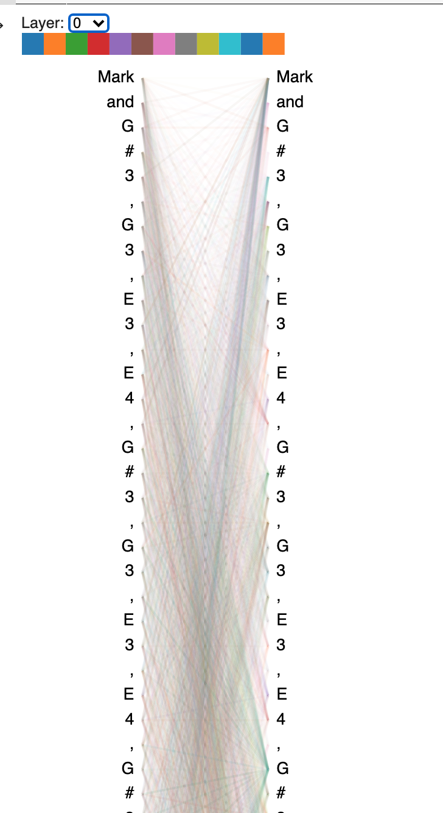
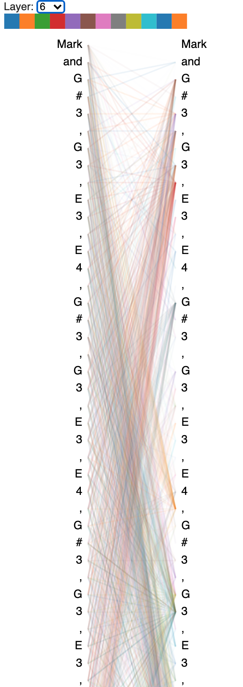
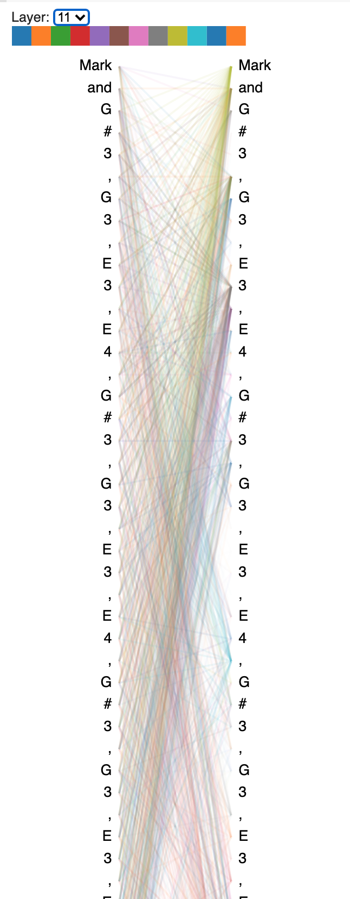

- [GPT2 model finetuning](#gpt2-model-finetuning)
    - [training library selection](#training-library-selection)
    - [data preparation](#data-preparation)
    - [finetuning and generation](#finetuning-and-generation)
- [Visualization](#visualization)
- [Discussion](#discussion)
- [Future Improvements](#future-improvements)

## GPT2 model finetuning

### training library selection

There are various approaches to finetune GPT2 model. one way is to finetune it against the pre-trained model from the [OpenAI GPT2 repo](https://github.com/openai/gpt-2). However, it will require that some work in setup. Alternatively, we could also use the [Huggingface GPT2 transformers](https://huggingface.co/transformers/model_doc/gpt2.html) to achieve similar objectives. 

We found this python library called [`gpt-2-simple`](https://github.com/minimaxir/gpt-2-simple), which is quite popular with 2.4k github stars. We decided to try this library because it is a nice wrapper around the GPT2 pre-trained model with minimal setup required with two convenient methods: `finetune` for finetuning, and `generate` to auto-generate text. In addition, it also provides a useful command line interface if we don't want to write code.

### data preparation

In order to feed music data into GPT2 model, we first need to convert midi files into a text format that GPT2 model is able to process. For this purpose, we used [`music21` library from MIT](http://web.mit.edu/music21/). `music21` parses the mid file into notes, chords (concurrent notes), and other events, which we can use to feed into the model. 

There are a few types of the music elements that we are interested in: 
1. notes: a single note that is played at a particular moment for a duration. We represent it by using its note + its octave, such as "C#3", "D-2", or "E3". 
2. chords: a collection of the notes that are played concurrently. We represent it by simply concatenating the aforementioned note representations with space.
3. other notes are displayed with their `music21` name. 

We then concatenate all these elements with command and output them into a single-column CSV file. Below is a sample sequence of notes that are converted from one midi file:

```
"Piano, tempo.MetronomeMark animato Quarter=120.01, C major, meter.TimeSignature 4/4, rest, rest, rest, rest, rest, tempo.MetronomeMark larghetto Quarter=60.0, D4, rest, G3, A3, B3, B4, G4, C5, A3, A3 C4 E4, G4 E4, rest, F3 A3 C4, E4, D4, G4, B3, C5, D5, E5, F5, E5, G4, A4, G4, E4, G4, E4, C4, A3, G4, E4, D4, C4, G3 B3 D4, A3, A3 C4, G3, F3, A3, A3, A3"
```

We are now ready to feed the songs into the GPT2 model for finetuning.

### finetuning and generation

The finetune is actually quite straightforward, `gpt2.finetune` is all we need, after `gtp2.download_model` function downloads the [pretrained model from google cloud](https://storage.googleapis.com/gpt-2). The `finetune` method takes the name of a text file and also the number of iterations to train the model. In our case, we used 1000 iterations. 

After finetuning is finished, the model is deposited into the checkpoint directory. We can then call the `gpt2.generate` method to auto-generate music notes. By default, it will start to generate music by itself. We can optionally specify a prefix, which sets the context for the music notes that is generated after it. 

It is interesting to note that the GPT2-generated output notes are pretty much all in the same semantic format as the input. This indicates that the finetuned GPT2 model has learned the "grammar" of this quite different music domain. 

You can find the hosted notebooks on google colab:

1. [finetuning notebook](https://colab.research.google.com/drive/1qhEN4_M43gRNU-zREZV_dse8mp7DK0WM?usp=sharing)
2. [generating and visualization notebook](https://colab.research.google.com/drive/1T-hssOMYS8d8cw4n6ufEAgaiUQlMbe5h?usp=sharing)

## Visualization

Visualization helps humans to see the patterns in the model. We have found, [BertViz](https://github.com/jessevig/bertviz), an open-source tool for visualizing self-attention in the BERT language representation model. BertViz works by displaying Bert self-attention in a correlation graph, so that the contribution of each token to the prediction is shown. BertViz extends earlier work by visualizing attention at three levels of granularity: the attention-head level, the model level, and the neuron level. 

Even though BertViz is designed for Bert as its name suggests, it works for any attention-based NLP neural network. In fact, BertViz supports HuggingFace GPT2 transformer with this [GPT2Model](https://github.com/jessevig/bertviz/blob/master/bertviz/transformers_neuron_view/modeling_gpt2.py) and [GPT2Tokenizer](https://github.com/jessevig/bertviz/blob/master/bertviz/transformers_neuron_view/tokenization_gpt2.py). 

However, `gpt-2-simple` package doesn't provide the attention output as huggingface does. It only outputs the generated text by default and attention information is not part of the output that can be requested.

Therefore, we had to make some modifications. Without getting into the details, gpt-2-simple code internally provides 2 layers in the outcome of the computation, which contains the past and present for each layer. The past is the input to the layer and the present is the output to the layer. In a way, this is the attention matrix for GPT-2 model. With some transposition (the main code is below), we are able to compute the attention matrix with the number of tokens * the number of tokens as its dimensions. 

```python
if return_attention:
    # past_n_present should be in the dimension of
    # [batch, layers, 2, heads, sequence, features]
    past = past_n_present[:, :, :1, :, :, :]
    present = past_n_present[:, :, 1:, :, :, :]
    # compute the past and present attetntion
    attention = tf.matmul(past/tf.cast(temperature, tf.float32), tf.transpose(present, perm=[0, 1, 2, 3, 5, 4]))
    attention = tf.nn.softmax(attention, axis=-1)
    return tokens, attention
else:
    return tokens
```

With this attention matrix and the token list, Bertviz readily outputs the attention graph.



## Discussion

The attention in music seems to be a bit more scattered than language models, and there doesn't seem to be a pattern for the individual notes to pay close attention to or focus on. However, one observation is that the later the layers, the more concentrated the attention becomes. see below for the comparison of 3 layers. 

<table>
	<tr>
		<th>
			Layer 0
		</th>
		<th>
			Layer 6
		</th>
		<th>
			Layer 11
		</th>
	</tr>
	<tr>
		<td>
			
		</td>
		<td>
			
		</td>
		<td>
			
		</td>
	</tr>
</table>


One plausible explanation is that the later layers have learned more about the orrelations between the notes to make the attentions more distinctive.

## Future Improvements

For future improvements, we would like to work on the following:

1. Encode music notes to make it atomic: with the default tokenization, GPT2 doesn't recognize music notes. for example: `C#2` is actually tokenized as 3 separate notes: `C`, `#`, and `3`, through the byte-pairing encoding. This is not ideal, as these 3 tokens are interpreted rather independently by the default language embedding. This presumably doesn't apply very well to the music context. It will take a lot of training data to provide the context for the model to learn it. It would be more suitable to tokenize a music note such as `C#2` as one note. We can do that with additions/modifications to the GPT2 `encoder.json` and `vocab.bpe` file. It will be interesting to see how GPT2 performs with distinct music notes encoding, with something similar to the code below:

```python
note_to_token = dict()
token_to_note = dict()

token = 50256

for octave in range(8):
  for main in 'ABCDEFG':
    for minor in ['#', '', '-']:
      token += 1
      note = f'{main}{minor}{octave}'
      note_to_token[note] = token
      token_to_note[token] = note

print(note_to_token)
print(token_to_note)

## =>
{'A#0': 50257, 'A0': 50258, 'A-0': 50259, 'B#0': 50260, 'B0': 50261, 'B-0': 50262, ...}
{50257: 'A#0', 50258: 'A0', 50259: 'A-0', 50260: 'B#0', 50261: 'B0', 50262: 'B-0', ...}

``` 

2. Another benefit of encoding music notes atomically is that it will make the visualization more straightforward. Currently, music notes are visualized at the character level, as the direct result of the current encoding approach. If a music note is encoded atomically, it will be displayed as one node in the Bertviz graph, which helps to make the graph clearer. 

3. Overfit prevention. Because we have only finetuned GPT2 on around 1000 midi files, a rather small number, it could potentially make the model overfit on the training data. The model could simply "memorize" the entire music set that is trained on. If we could gather a richer data set, the probability of overfitting could be reduced.

4. Training data. At this point, our training data set only contains one instrument (piano) and only the pitch and timing information. We have not included the rich data of velocity and also other instruments. This is done mostly for simplicity. For future efforts, it will be interesting to devise an encoding mechanism that includes this additional information in the training data in order to get richer and more engaging music output. 